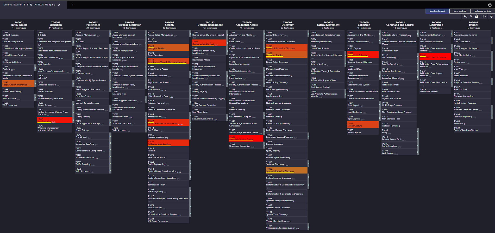
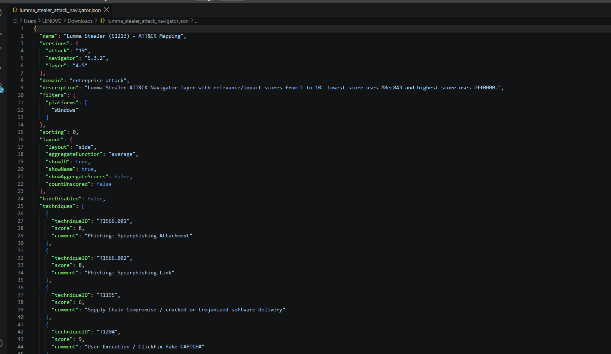

# Lumma Stealer Malware Research and MITRE ATT&CK Mapping Report

## 1. Introduction

Lumma Stealer, also known as **LummaC2**, is a Windows-based information-stealing malware family that has been active since at least 2022. It operates using a **Malware-as-a-Service (MaaS)** model, allowing multiple threat actors and affiliates to generate malware builds, manage command-and-control communications, and access stolen information through an operator panel. MITRE ATT&CK tracks the malware as **S1213 – Lumma Stealer**.

Microsoft has observed Lumma being used by multiple financially motivated threat actors. Its primary objective is credential and information theft, although it is also capable of downloading additional malware, making an initial Lumma infection a possible precursor to more severe compromise.

---

# Task 1 – Malware Research

## 2. Malware Summary

Lumma primarily targets sensitive information stored on Windows endpoints. Its collection capabilities include browser credentials, authentication cookies, autofill information, cryptocurrency wallets, VPN configuration data, FTP client information, Telegram data, documents, and system metadata.

The malware is written mainly using **C++ and Assembly** and contains significant obfuscation designed to make static and dynamic malware analysis more difficult. Microsoft has observed LLVM-based protection, control-flow flattening, control-flow obfuscation, stack decryption, dead code, and low-level system calls in Lumma builds.

---

## 3. Delivery Methods Observed in the Wild

Lumma does not depend on a single infection vector. Different affiliates use different delivery chains.

### 3.1 Phishing

Attackers have distributed Lumma through phishing emails containing malicious attachments or links. Campaigns may impersonate trusted organizations and use urgent messages such as reservations, account notifications, or cancellation notices to persuade users to interact with malicious content.

Relevant ATT&CK techniques include:

- T1566.001 – Spearphishing Attachment
- T1566.002 – Spearphishing Link

### 3.2 Malvertising and Search Engine Poisoning

Threat actors have placed malicious advertisements in search results for popular software such as browser updates and utilities.

Victims are redirected to cloned or attacker-controlled websites that appear legitimate but provide a malicious installer containing Lumma.

### 3.3 Trojanized and Cracked Software

Lumma has frequently been bundled with pirated or modified versions of legitimate applications.

The application may appear to install normally while Lumma executes silently in the background.

MITRE also documents cracked-software delivery in Lumma activity under **T1195 – Supply Chain Compromise**.

### 3.4 Fake CAPTCHA / ClickFix

One of the most significant modern Lumma delivery techniques is **ClickFix**.

The victim encounters a fake CAPTCHA or verification page. The webpage copies a malicious command into the clipboard and instructs the victim to:

1. Press `Windows + R`.
2. Paste the clipboard contents.
3. Press Enter.

The command commonly launches PowerShell or another Windows component that retrieves and executes the malicious payload.

Microsoft observed Lumma campaigns using ClickFix and Base64-encoded PowerShell in this manner.

Relevant techniques include:

- T1204 – User Execution
- T1059.001 – PowerShell
- T1140 – Deobfuscate/Decode Files or Information

### 3.5 GitHub and Legitimate Service Abuse

Attackers have abused legitimate services such as **GitHub repositories and releases** to host malicious scripts or binaries disguised as legitimate applications, patches, or utilities.

This allows malicious files to initially originate from infrastructure that users may consider trustworthy.

### 3.6 Drive-by Downloads

Compromised legitimate websites have also been modified with malicious JavaScript.

When users visit the compromised page, the JavaScript can redirect them or initiate an additional infection chain that ultimately delivers Lumma.

### 3.7 Delivery Through Other Malware

Lumma may also be installed as a secondary payload.

For example, Microsoft observed other loaders and malware including **DanaBot** delivering Lumma onto already-compromised endpoints.

---

## 4. Execution

After delivery, Lumma uses several execution mechanisms depending on the specific campaign.

### 4.1 PowerShell

PowerShell is frequently used to download, decode, or execute additional stages of the infection.

Encoded content may be Base64-decoded before execution.

Relevant techniques:

- T1059.001 – PowerShell
- T1140 – Deobfuscate/Decode Files or Information
- T1027.013 – Encrypted/Encoded File

### 4.2 MSHTA

Lumma campaigns have abused the legitimate Windows utility:

```text
mshta.exe
```

to execute remotely retrieved or locally stored malicious content.

Technique:

**T1218.005 – System Binary Proxy Execution: Mshta**

### 4.3 AutoIT / AutoHotKey

Some campaigns use AutoIT scripts and legitimate AutoIT interpreters as part of the malware execution chain.

Technique:

**T1059.010 – AutoHotKey & AutoIT**

### 4.4 Process Hollowing

Lumma loaders can inject malicious code into legitimate Windows processes.

Microsoft observed processes including:

```text
msbuild.exe
regasm.exe
regsvcs.exe
explorer.exe
```

being used as process-hollowing targets.

MITRE has also documented Lumma process hollowing using legitimate programs such as `BitLockerToGo.exe`.

Technique:

**T1055.012 – Process Injection: Process Hollowing**

### 4.5 Reflective Code Loading

Some Lumma variants load malicious components directly into memory rather than storing the complete executable payload on disk.

Technique:

**T1620 – Reflective Code Loading**

### 4.6 DLL Side-Loading

Legitimate applications may be used to load malicious DLL files located beside trusted executables.

Technique:

**T1574.001 – Hijack Execution Flow: DLL**

MITRE directly associates Lumma with malicious DLL side-loading.

---

## 5. Persistence

Lumma does not necessarily require persistence in every infection because information stealers can collect and exfiltrate data immediately.

However, persistence has been observed.

Lumma can create a Registry Run key under:

```text
HKCU\SOFTWARE\Microsoft\Windows\CurrentVersion\Run
```

which causes the malicious executable to execute when the user logs in.

Technique:

**T1547.001 – Boot or Logon Autostart Execution: Registry Run Keys / Startup Folder**

The malware has also been observed installing malicious browser extensions, potentially providing continued access to browser information.

Technique:

**T1176.001 – Software Extensions: Browser Extensions**

---

## 6. Discovery and Environment Profiling

Before or during information collection, Lumma gathers information about the victim endpoint.

Collected information can include:

- Operating system version
- CPU information
- System locale
- Installed applications
- Browser information
- Security software
- Virtualization information
- GPU configuration

Microsoft confirms that Lumma gathers host telemetry and installed-application information.

MITRE documents the following relevant techniques:

| Technique | Description |
|---|---|
| T1082 | System Information Discovery |
| T1217 | Browser Information Discovery |
| T1518.001 | Security Software Discovery |
| T1497.001 | Virtualization/Sandbox Evasion: System Checks |

---

## 7. Credential and Information Theft

Information theft represents the primary objective of Lumma.

### 7.1 Browser Credentials

Lumma targets stored credentials from Chromium-, Edge-, Mozilla-, and Gecko-based browsers.

It can collect saved passwords and autofill information.

Technique:

**T1555.003 – Credentials from Web Browsers**

### 7.2 Session Cookies

Lumma extracts browser cookies.

Stolen authenticated session cookies may potentially allow an attacker to access services without entering the original password again.

Technique:

**T1539 – Steal Web Session Cookie**

MITRE directly documents Lumma harvesting cookies from multiple browsers.

### 7.3 Cryptocurrency Wallets

The malware searches for cryptocurrency wallet information, wallet files, private information, and browser wallet extensions.

Observed targets include wallets such as:

- MetaMask
- Electrum
- Exodus

### 7.4 Application Information

Lumma may steal data associated with:

- VPN clients
- `.ovpn` configuration files
- FTP clients
- Email applications
- Telegram

### 7.5 User Documents

Lumma can search user directories for documents.

Microsoft has specifically observed targeting of files with extensions such as:

```text
.pdf
.docx
.rtf
```

### 7.6 Screen Capture

Lumma can capture screenshots from compromised systems.

Technique:

**T1113 – Screen Capture**

---

## 8. Data Collection and Staging

Collected information can be automatically gathered and organized before exfiltration.

Relevant techniques include:

- **T1119 – Automated Collection**
- **T1074.001 – Data Staged: Local Data Staging**

MITRE has observed Lumma creating data-staging locations under paths such as:

```text
%USERPROFILE%\AppData\Roaming
```

---

## 9. Command and Control

Lumma maintains a flexible C2 infrastructure.

Microsoft describes Lumma using:

- Hardcoded Tier-1 C2 servers
- Telegram-based fallback locations
- Steam profiles as fallback infrastructure
- Cloudflare proxying
- HTTPS communication

The C2 infrastructure can change between Lumma versions and campaigns.

Relevant techniques include:

- **T1071.001 – Application Layer Protocol: Web Protocols**
- **T1573.002 – Encrypted Channel**

C2 communication typically uses HTTPS.

---

## 10. Exfiltration

After gathering victim information, Lumma sends the collected data to attacker infrastructure over its existing C2 channel.

Technique:

**T1041 – Exfiltration Over C2 Channel**

MITRE documents Lumma exfiltrating information through HTTP and HTTPS C2 traffic.

---

## 11. Defense Evasion / Stealth

Lumma contains multiple capabilities intended to make detection and analysis more difficult.

### Obfuscation

Lumma uses encoded or encrypted payloads and significant code obfuscation.

Relevant techniques:

- T1027 – Obfuscated Files or Information
- T1027.013 – Encrypted/Encoded File
- T1140 – Deobfuscate/Decode Files or Information

### Debugger Detection

Lumma checks for analysis and debugging utilities including strings associated with tools such as:

```text
x32dbg
x64dbg
windbg
ollydbg
dnSpy
IDA
```

Technique:

**T1622 – Debugger Evasion**

### Sandbox Detection

Lumma may inspect system resources, usernames, WMI information, processes, services, files, and GPU configurations to determine whether it is executing inside a sandbox or virtual machine.

Technique:

**T1497.001 – Virtualization/Sandbox Evasion: System Checks**

### AMSI Bypass

MITRE documents attempts by Lumma to interfere with Microsoft's Antimalware Scan Interface functionality.

Technique:

**T1685 – Disable or Modify Tools**

---

## 12. Indicators of Compromise

Lumma infrastructure is highly dynamic. Domains, IP addresses, binaries, and hashes may change between campaigns.

Therefore, the following indicators should be considered **historically observed IoCs suitable for threat hunting**, rather than a permanent blocklist.

### File Hashes

| Type | Indicator | Context |
|---|---|---|
| SHA-256 | `80741061ccb6a337cbdf1b1b75c4fcfae7dd6ccde8ecc333fcae7bcca5dc8861` | Lumma sample analyzed by Trellix |
| SHA-256 | `d669078a7cdcf71fb3f2c077d43f7f9c9fdbdb9af6f4d454d23a718c6286302a` | Lumma campaign reported by CrowdStrike |
| SHA-256 | `B127DE888F09CE23937C12B7FCCFA47A8F48312B0E43EB59B6243F665C6D366A` | Lumma binary observed in malicious GitHub activity |

These samples were independently reported during Lumma investigations.

### Network IoCs

Examples of previously observed Lumma-associated infrastructure include:

```text
snail-r1ced.cyou
genhqq.xyz
104.21.37.171
172.67.144.66
172.67.214.67
45.61.136.138
5.161.229.58
64.52.80.211
```

Additional Lumma C2 domains observed in a CrowdStrike investigation included:

```text
indexterityszcoxp.shop
lariatedzugspd.shop
callosallsaospz.shop
outpointsozp.shop
```

### Host-based IoCs and Behavioral Indicators

Potential host indicators include:

```text
HKCU\SOFTWARE\Microsoft\Windows\CurrentVersion\Run
```

Unexpected executables or staging directories under:

```text
%APPDATA%
%LOCALAPPDATA%
```

Suspicious processes involving:

```text
powershell.exe
mshta.exe
AutoIt3.exe
msbuild.exe
regasm.exe
regsvcs.exe
```

Unexpected access by unusual processes to browser databases such as Chrome or Edge credential and cookie stores should also be treated as highly suspicious.

---

# Task 2 – MITRE ATT&CK Mapping

## 13. ATT&CK Version

This report uses the Enterprise ATT&CK model and Lumma S1213 behavior documented by MITRE.

At the time of preparation, the current MITRE ATT&CK release is **ATT&CK v19.2**.

The scoring system represents analyst-assigned relevance and potential security impact:

- **1 = lowest relevance / criticality**
- **10 = highest relevance / criticality**

Navigator color gradient:

- Lowest score: `#8ec843`
- Highest score: `#ff0000`

---

## 14. Lumma ATT&CK Mapping

| Tactic | Technique | Sub-technique | Score |
|---|---|---|---:|
| Initial Access | T1566 Phishing | T1566.001 Spearphishing Attachment | 8 |
| Initial Access | T1566 Phishing | T1566.002 Spearphishing Link | 8 |
| Initial Access | T1195 Supply Chain Compromise | N/A | 6 |
| Execution | T1204 User Execution | N/A | 9 |
| Execution | T1204 User Execution | T1204.002 Malicious File | 8 |
| Execution | T1059 Command and Scripting Interpreter | T1059.001 PowerShell | 9 |
| Execution | T1059 Command and Scripting Interpreter | T1059.006 Python | 6 |
| Execution | T1059 Command and Scripting Interpreter | T1059.010 AutoHotKey & AutoIT | 7 |
| Execution / Stealth | T1218 System Binary Proxy Execution | T1218.005 Mshta | 8 |
| Stealth | T1574 Hijack Execution Flow | T1574.001 DLL | 8 |
| Stealth | T1055 Process Injection | T1055.012 Process Hollowing | 8 |
| Execution / Stealth | T1620 Reflective Code Loading | N/A | 8 |
| Persistence | T1547 Boot or Logon Autostart Execution | T1547.001 Registry Run Keys / Startup Folder | 7 |
| Stealth | T1027 Obfuscated Files or Information | N/A | 8 |
| Stealth | T1027 Obfuscated Files or Information | T1027.013 Encrypted/Encoded File | 8 |
| Stealth | T1140 Deobfuscate/Decode Files or Information | N/A | 7 |
| Stealth | T1622 Debugger Evasion | N/A | 6 |
| Stealth | T1497 Virtualization/Sandbox Evasion | T1497.001 System Checks | 6 |
| Stealth | T1564 Hide Artifacts | T1564.003 Hidden Window | 6 |
| Stealth | T1553 Subvert Trust Controls | T1553.002 Code Signing | 7 |
| Defense Impairment | T1685 Disable or Modify Tools | N/A | 8 |
| Discovery | T1518 Software Discovery | T1518.001 Security Software Discovery | 5 |
| Discovery | T1082 System Information Discovery | N/A | 5 |
| Discovery | T1217 Browser Information Discovery | N/A | 7 |
| Credential Access | T1555 Credentials from Password Stores | T1555.003 Credentials from Web Browsers | 10 |
| Credential Access | T1539 Steal Web Session Cookie | N/A | 10 |
| Collection | T1113 Screen Capture | N/A | 7 |
| Collection | T1119 Automated Collection | N/A | 9 |
| Collection | T1074 Data Staged | T1074.001 Local Data Staging | 7 |
| Persistence / Collection | T1176 Software Extensions | T1176.001 Browser Extensions | 8 |
| Command and Control | T1071 Application Layer Protocol | T1071.001 Web Protocols | 8 |
| Command and Control | T1573 Encrypted Channel | T1573.002 Asymmetric Cryptography | 8 |
| Exfiltration | T1041 Exfiltration Over C2 Channel | N/A | 10 |

These behaviors are based primarily on the official Lumma Stealer S1213 ATT&CK mapping.

---

## 15. Scoring Rationale

The highest scores were assigned to:

### T1555.003 – Credentials from Web Browsers: 10

Credential theft is one of Lumma's main objectives and can directly compromise organizational and personal accounts.

### T1539 – Steal Web Session Cookie: 10

Session-cookie theft can enable unauthorized access to already-authenticated services.

### T1041 – Exfiltration Over C2 Channel: 10

Collection has limited attacker value unless the stolen information is successfully transferred from the victim endpoint.

### T1059.001 – PowerShell: 9

PowerShell repeatedly appears in Lumma delivery and execution chains, particularly ClickFix campaigns.

### T1119 – Automated Collection: 9

Lumma's core information-stealing functionality depends heavily on automated collection.

Lower-scored discovery techniques such as System Information Discovery received scores around five because they mainly support the malware operation rather than directly causing data compromise.

---

## 16. ATT&CK Navigator Evidence

The following screenshots document the ATT&CK Navigator mapping and the corresponding Navigator JSON configuration used in this project.

### Figure 1 – ATT&CK Navigator Technique Mapping



The ATT&CK Navigator view shows the Lumma-related techniques selected across the Enterprise ATT&CK matrix. The applied green-to-red gradient represents the analyst-assigned relevance and criticality scores.

### Figure 2 – ATT&CK Navigator JSON Configuration



The Navigator JSON contains the layer configuration, ATT&CK version, scoring values, platform selection, and color-gradient settings used to generate the mapping shown above.

---

## 17. Detection Recommendations

Detection should focus on Lumma's behavioral patterns rather than relying exclusively on hashes or domains.

### Endpoint Detection

Monitor unusual execution relationships involving:

```text
powershell.exe
mshta.exe
AutoIt3.exe
msbuild.exe
regasm.exe
regsvcs.exe
```

especially where these processes initiate network connections or are launched from browsers, temporary folders, downloaded archives, or user-writable directories.

EDR rules should also detect suspicious process hollowing or memory injection into legitimate Windows executables.

### PowerShell Monitoring

Enable PowerShell logging including:

- Script Block Logging
- Module Logging
- PowerShell Transcription

Alert on:

- Base64-encoded commands
- `-EncodedCommand`
- Download cradle behavior
- PowerShell launched through Windows Run
- PowerShell started by a browser or `mshta.exe`

These detections are particularly useful against ClickFix-based Lumma infections.

### Browser Credential Access Monitoring

Monitor unexpected access to browser credential stores and cookie databases.

Processes that normally have no reason to interact with Chrome, Edge, Firefox, or other browser credential databases should generate high-priority alerts.

### Network Detection

Inspect outbound HTTPS connections from unusual processes.

High-value detections include:

- `powershell.exe` establishing external HTTPS sessions
- `mshta.exe` communicating externally
- AutoIT executables contacting Internet hosts
- Unknown binaries under AppData making repeated POST requests
- Newly registered or low-reputation domains
- Unusual connections to dynamically changing infrastructure

Static C2 blocklists should supplement behavioral detection rather than replace it.

### Registry Monitoring

Monitor modifications to:

```text
HKCU\SOFTWARE\Microsoft\Windows\CurrentVersion\Run
```

especially when values reference executables located under:

```text
AppData
Temp
```

or other user-writable locations.

---

## 18. Hardening Recommendations

### Application Control

Use technologies such as Windows Defender Application Control or AppLocker to restrict execution from:

- `AppData`
- `Temp`
- Download directories
- Other user-writable locations where appropriate

### PowerShell Hardening

Restrict unnecessary PowerShell usage and enforce modern PowerShell security controls.

### Web and DNS Filtering

Block malicious, newly registered, and low-reputation domains where appropriate.

Deploy DNS filtering and secure web gateways.

### Email Security

Use advanced email filtering and sandbox suspicious attachments and links.

### Browser Protection

Keep browsers patched and restrict unauthorized browser extensions.

### Least Privilege

Users should not operate with local administrative privileges unless operationally necessary.

### Software Policy

Prevent users from installing cracked or pirated software and restrict downloads from unauthorized software repositories.

### User Awareness

Security training should specifically address **ClickFix / fake CAPTCHA attacks**.

Users should understand that legitimate CAPTCHA pages should not require them to:

- Open Windows Run
- Paste PowerShell commands
- Paste commands from the clipboard
- Manually execute scripts

Microsoft's observations show that user manipulation through fake CAPTCHA workflows is an important Lumma delivery vector.

---

## 19. Incident Response Considerations

Because Lumma focuses on credential and session theft, simply deleting the malware executable is insufficient after confirmed compromise.

Response procedures should include:

1. Isolate the affected endpoint.
2. Remove malicious files and persistence mechanisms.
3. Collect forensic evidence.
4. Reset passwords for accounts used on the endpoint.
5. Revoke active browser and application sessions.
6. Revoke affected authentication tokens.
7. Review MFA registrations.
8. Review email, VPN, cloud, and identity-provider logs.
9. Investigate suspicious authentication from other devices or locations.
10. Search the environment for the same Lumma TTPs and IoCs.

Because Lumma can also install additional malware, responders should determine whether a second-stage payload was deployed before declaring the endpoint clean.

---

## 20. Conclusion

Lumma Stealer is a highly adaptable information-stealing malware family whose effectiveness comes from the combination of social engineering, flexible delivery infrastructure, stealth techniques, browser credential theft, session-cookie theft, automated collection, and encrypted C2 communications.

Its use of MaaS enables multiple independent threat actors to operate different campaigns, making individual hashes and domains short-lived indicators.

Effective defense against Lumma therefore requires a combination of threat intelligence, behavioral endpoint monitoring, PowerShell visibility, browser credential-access monitoring, network analytics, email security, application control, and security awareness.

MITRE ATT&CK mapping provides defenders with a useful method of converting observed Lumma behavior into concrete detection and defensive priorities.

---

## Disclaimer

This report was created for **educational, malware research, threat intelligence, and defensive cybersecurity purposes only**.
