# Semgrep SAST Integration with GitHub Actions

## 1. Introduction

The purpose of this exercise was to integrate **Semgrep SAST (Static
Application Security Testing)** into a GitHub Actions CI/CD workflow for
the **OWASP Juice Shop** project.

The repository was forked and cloned to a local Kali Linux machine. A
new GitHub Actions workflow named `semgrep-sast.yml` was created and
configured to automatically execute Semgrep whenever code is pushed to
the repository.

After verifying the initial SAST scan, a new Python file was added and
pushed to the remote repository to confirm that the push event
automatically triggers another Semgrep security scan.

## 2. Forking the OWASP Juice Shop Repository

The official OWASP Juice Shop repository was first forked into the
personal GitHub account.

This created a personal copy of the project where the GitHub Actions
workflow and source code could be modified without affecting the
original repository.

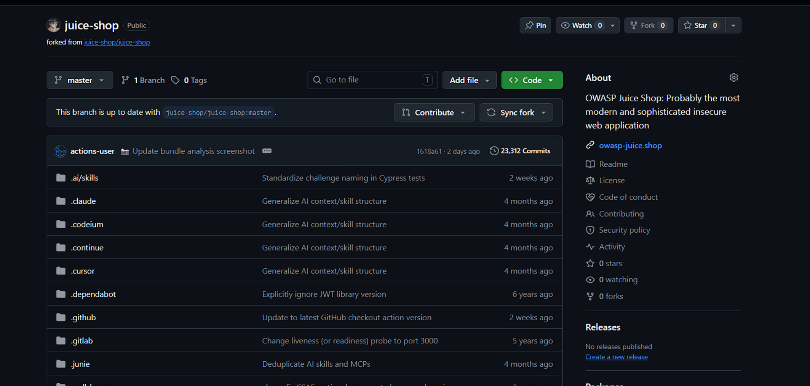

## 3. Cloning the Repository

After creating the fork, the repository was cloned to the local Kali
Linux machine using Git.

``` bash
git clone https://github.com/Malbarbari/juice-shop.git
```

After cloning, the repository directory was entered:

``` bash
cd juice-shop
```

The configured Git remote was then verified:

``` bash
git remote -v
```

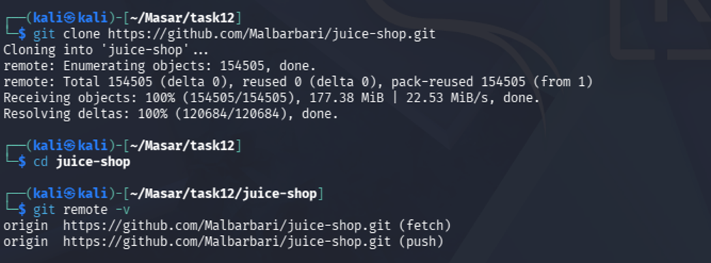

The output confirmed that both the fetch and push remote URLs point to
the personal fork.

## 4. Creating the Semgrep GitHub Actions Workflow

A new GitHub Actions workflow file was created at:

``` text
.github/workflows/semgrep-sast.yml
```

The workflow was configured as follows:

``` yaml
name: Semgrep SAST

on:
  push:

jobs:
  semgrep:
    name: Semgrep SAST Scan
    runs-on: ubuntu-latest

    steps:
      - name: Checkout Source Code
        uses: actions/checkout@v4

      - name: Install Semgrep
        run: pip install semgrep

      - name: Run Semgrep SAST Scan
        run: semgrep scan --config auto .
```

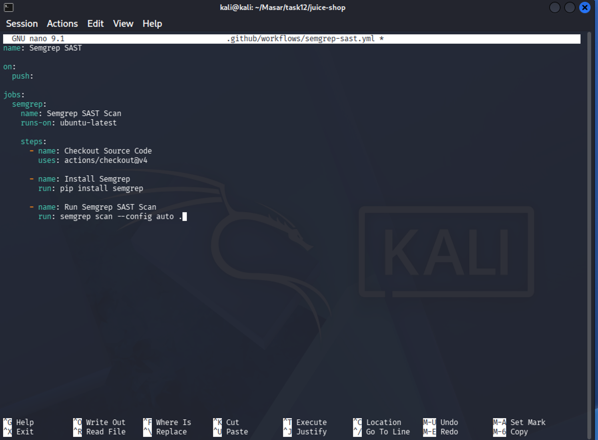

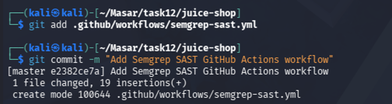

The `push` trigger causes GitHub Actions to automatically execute the
workflow whenever new changes are pushed to the repository.

The workflow performs three main operations:

1.  Checks out the repository source code.
2.  Installs Semgrep on the GitHub Actions runner.
3.  Executes a Semgrep scan against the source code and outputs the
    results directly to the runner console.

## 5. Adding and Committing the Workflow

After creating the workflow file, it was added to Git staging:

``` bash
git add .github/workflows/semgrep-sast.yml
```

The workflow was then committed:

``` bash
git commit -m "Add Semgrep SAST GitHub Actions workflow"
```

Git successfully created the commit and added the new workflow file to
the repository.

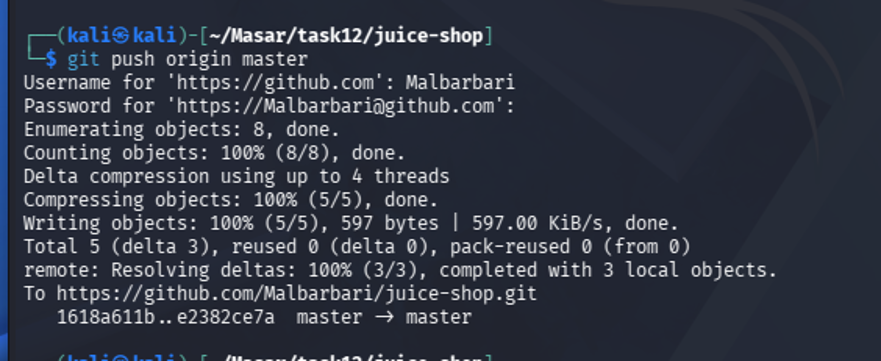

## 6. Pushing the Workflow to GitHub

The commit containing the new Semgrep workflow was pushed to the remote
repository:

``` bash
git push origin master
```

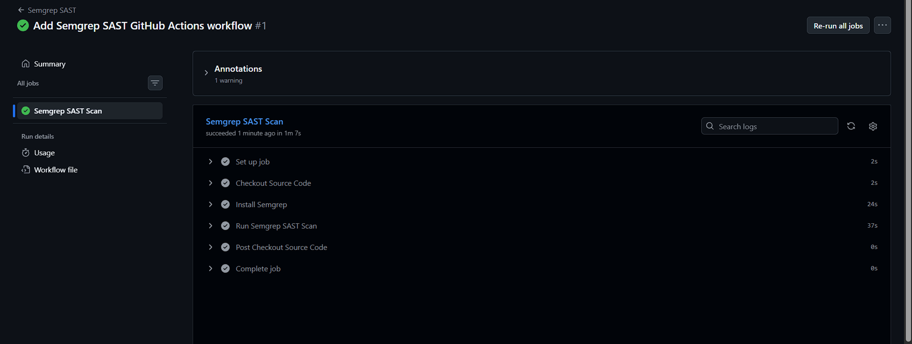

The push completed successfully, which uploaded `semgrep-sast.yml` to
the GitHub repository.

Because the workflow was configured with the `push` event, this action
also triggered the first Semgrep SAST workflow execution.

## 7. First Semgrep SAST Workflow Execution

After the push, GitHub Actions automatically started the Semgrep SAST
workflow.

The workflow successfully completed all configured steps:

-   Set up the GitHub Actions runner.
-   Checkout source code.
-   Install Semgrep.
-   Run the Semgrep SAST scan.
-   Complete the job.

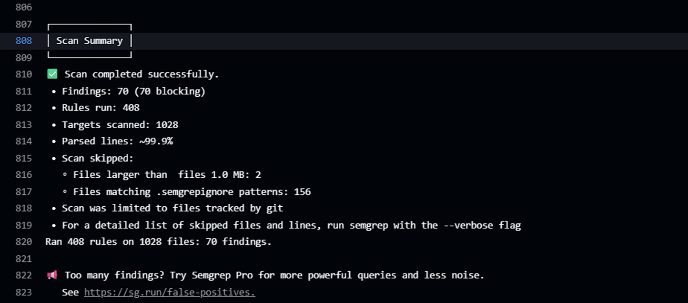

The successful execution confirmed that the Semgrep SAST workflow was
correctly configured and operational.

## 8. Initial Semgrep Scan Results

The results of the Semgrep scan were displayed directly in the GitHub
Actions runner console.

The initial scan produced the following summary:

``` text
Scan completed successfully.
Findings: 70 (70 blocking)
Rules run: 408
Targets scanned: 1028
Parsed lines: ~99.9%
Ran 408 rules on 1028 files: 70 findings.
```

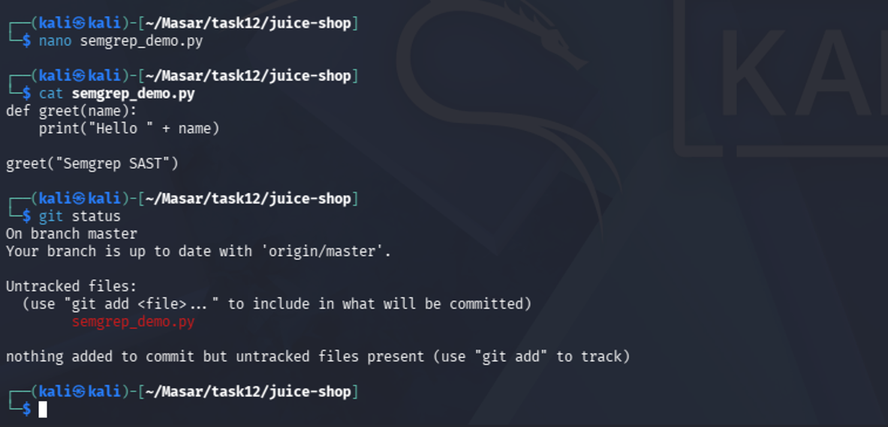

Semgrep successfully scanned **1,028 targets** using **408 rules** and
reported **70 findings**.

This confirms that the SAST tool successfully analyzed the Juice Shop
source code and logged its results directly to the GitHub Actions runner
console.

## 9. Adding New Python Code

To verify that a new code change would automatically trigger the
workflow, a new Python file named:

``` text
semgrep_demo.py
```

was created.

The following Python code was added:

``` python
def greet(name):
    print("Hello " + name)

greet("Semgrep SAST")
```

The new file was verified using:

``` bash
cat semgrep_demo.py
```

Git status was also checked:

``` bash
git status
```

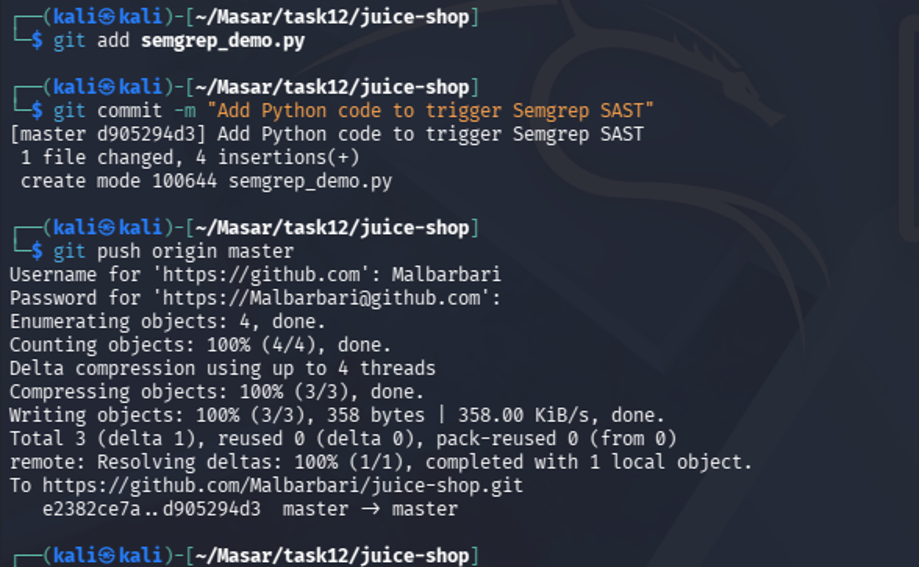

The output showed `semgrep_demo.py` as a new untracked file, confirming
that new source code had been added to the repository.

## 10. Committing and Pushing the New Code

The new Python file was added to Git:

``` bash
git add semgrep_demo.py
```

It was then committed:

``` bash
git commit -m "Add Python code to trigger Semgrep SAST"
```

Finally, the new code was pushed to the remote repository:

``` bash
git push origin master
```

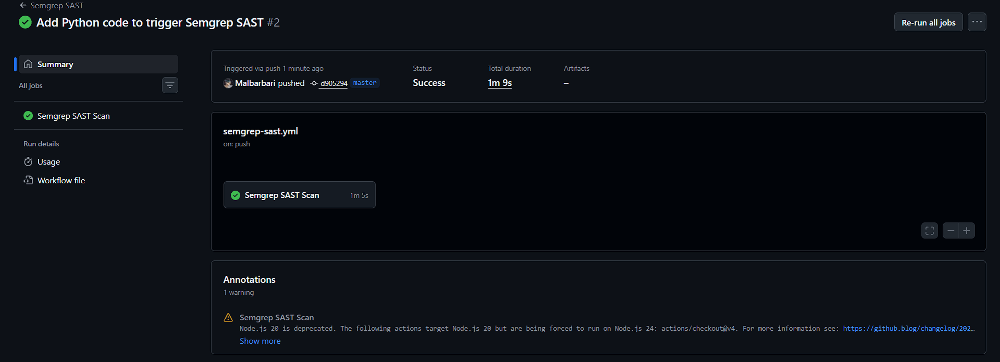

The push completed successfully.

Since the Semgrep workflow was configured with:

``` yaml
on:
  push:
```

this new push automatically triggered another Semgrep SAST scan.

## 11. Automatic Workflow Trigger After Code Push

After pushing `semgrep_demo.py`, GitHub Actions automatically created a
second Semgrep SAST workflow run.

The GitHub Actions page showed:

``` text
Add Python code to trigger Semgrep SAST #2
```

The workflow also explicitly indicated:

``` text
Triggered via push
```

The Semgrep SAST Scan job completed successfully.

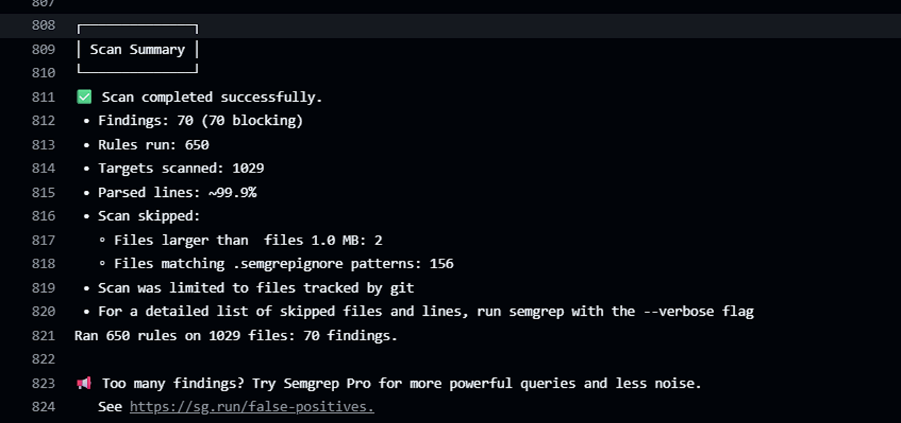

This demonstrates that the workflow correctly monitors the push event
and automatically executes the SAST scan whenever new code is pushed to
the repository.

## 12. Final Semgrep Scan Results

The second Semgrep scan also completed successfully and logged its
results directly to the GitHub Actions runner console.

The final scan summary was:

``` text
Scan completed successfully.
Findings: 70 (70 blocking)
Rules run: 650
Targets scanned: 1029
Parsed lines: ~99.9%
Ran 650 rules on 1029 files: 70 findings.
```

The number of scanned targets increased from:

``` text
1028 → 1029
```

after adding `semgrep_demo.py`, confirming that the newly added Python
file was included in the subsequent repository scan.

The scan reported **70 findings** while successfully analyzing **1,029
targets** using **650 rules**.

## 13. Conclusion

The Semgrep SAST integration with GitHub Actions was successfully
implemented on the forked OWASP Juice Shop repository.

A custom `semgrep-sast.yml` workflow was created and configured to run
automatically on every push event. The workflow successfully installed
Semgrep, scanned the Juice Shop source code, and displayed the security
findings directly in the GitHub Actions runner console.

The initial scan analyzed **1,028 targets** and identified **70
findings**. A new Python source file was then added, committed, and
pushed to the repository. This push automatically triggered a second
Semgrep workflow execution, which successfully scanned **1,029 targets**
and reported **70 findings**.

The exercise demonstrates how SAST security testing can be integrated
into a CI/CD pipeline to automatically analyze source code whenever new
changes are pushed to a repository.
