# Malware Analysis Report — `malware.exe`

## Introduction

This report documents the malware analysis of a suspicious Windows executable named `malware.exe`, provided as part of the Session 21 exercise. The sample is described as being similar to a Lumma Stealer dropper and was analyzed in an isolated malware-analysis environment to identify its static characteristics, runtime behavior, Indicators of Compromise (IOCs), and detection opportunities.

The analysis was performed in multiple stages. First, static analysis was conducted without executing the sample to examine its PE metadata, cryptographic hashes, imported functions, sections, embedded strings, and potential indicators such as URLs, registry paths, mutex names, and User-Agent strings. The identified artifacts were then evaluated based on their relevance and reliability as weak or strong indicators.

Next, controlled dynamic analysis was performed inside a dedicated FLARE VM environment. Runtime activity was monitored using tools such as Process Monitor and Wireshark to observe file-system modifications, registry activity, process behavior, persistence attempts, and network communication patterns.

The collected evidence was then consolidated into an IOC table containing network, file-system, registry, process, and behavioral indicators with confidence ratings and supporting rationale. Finally, a YARA detection rule was developed using selected family-oriented indicators and structural PE conditions, followed by a validation plan to verify detection against both the analyzed malware sample and legitimate files.

The purpose of this analysis is to demonstrate a structured malware-analysis workflow that transforms raw technical observations into actionable indicators and practical detection logic while maintaining a controlled and safe testing environment.

---

# 1. Analysis Environment Setup

The malware analysis was performed inside a dedicated FLARE VM virtual machine to reduce the risk of exposing the host operating system to the suspicious executable. FLARE VM provides a Windows-based malware-analysis environment containing tools for static analysis, dynamic analysis, process monitoring, registry inspection, and network investigation.

The suspicious sample was kept inside the virtual machine and was not executed during the initial static-analysis phase. This allowed the file structure, metadata, strings, imports, and embedded indicators to be inspected safely before any runtime behavior was observed.


*Figure 1. FLARE VM environment used for malware analysis.*

The use of an isolated virtual machine provided a controlled environment for examining the malware while minimizing interaction with the host system. A clean virtual-machine state was maintained so the environment could be restored if necessary after dynamic analysis.

## 1.1 Network Isolation

Before analyzing the malware, the network configuration of the FLARE VM was reviewed to verify the state of the analysis environment. The virtual machine was assigned the IPv4 address `192.168.132.131/24`. No default gateway was configured at the time of inspection, reducing the possibility of unintended external network communication during the initial analysis stage.

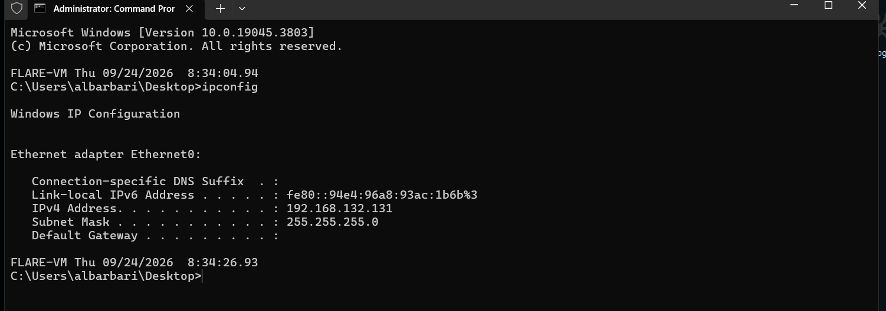

*Figure 2. FLARE VM network configuration before malware analysis.*

Network access was kept restricted during the static-analysis phase. Network monitoring and controlled connectivity would only be introduced later during dynamic analysis when tools such as Wireshark were prepared to capture the sample's runtime communication.

## 1.2 Analysis Methodology

The analysis followed a two-stage workflow consisting of static and dynamic analysis. Static analysis was performed first without executing the sample. This phase focused on identifying cryptographic hashes, PE metadata, managed .NET structure, embedded strings, persistence-related artifacts, network configuration values, and other potential indicators of compromise.

After the static findings were documented, the sample was executed inside an isolated FLARE VM environment for controlled dynamic analysis. Process Monitor was used to observe registry and file-system activity, while Wireshark and FakeNet-NG were used to safely capture and simulate the sample's network communication without providing unrestricted Internet access.

Findings from both phases were correlated to distinguish generic artifacts from higher-confidence indicators. Static observations were treated as hypotheses until runtime evidence confirmed the corresponding behavior where possible.

## 1.3 Tools Used

| Tool | Purpose |
|---|---|
| HashMyFiles | Calculated MD5 and SHA-256 hashes for sample identification. |
| PEStudio | Examined PE metadata, architecture, timestamp, sections, and .NET characteristics. |
| PE-bear | Supplementary inspection of the PE structure and managed executable characteristics. |
| dnSpy | Decompiled the .NET executable and inspected embedded configuration and program logic. |
| Strings utility | Extracted readable strings and embedded IOC-related values. |
| Process Monitor (Procmon) | Monitored registry modifications and file-system activity during execution. |
| Wireshark | Captured and analyzed runtime HTTP communication and beaconing behavior. |
| FakeNet-NG | Simulated network services inside the isolated environment to safely observe malware communication. |

---

# 2. Static Analysis

## 2.1 File Identification and Hashing

Static analysis began by uniquely identifying the suspicious executable before examining its internal structure. The sample was loaded into HashMyFiles without execution, and both MD5 and SHA-256 cryptographic hashes were calculated. SHA-256 was treated as the primary sample identifier, while MD5 was retained as an additional reference for comparison and IOC documentation.

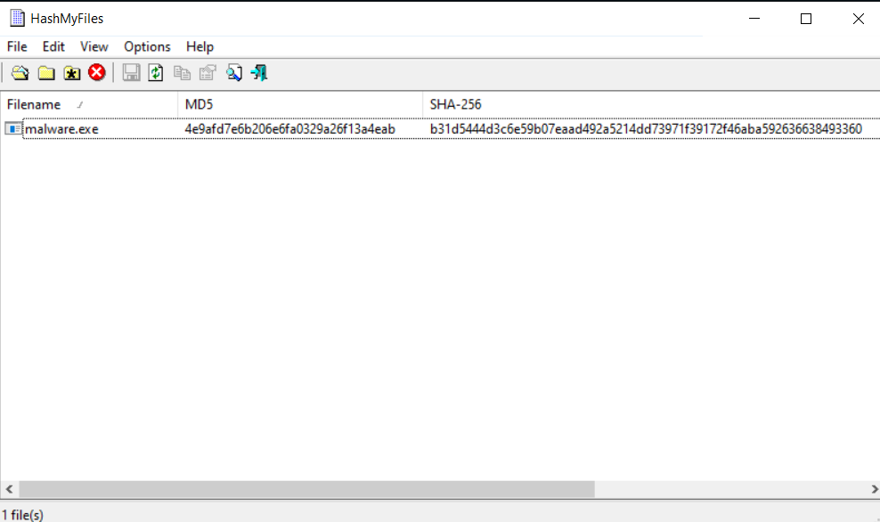

*Figure 3. MD5 and SHA-256 hashes calculated for malware.exe using HashMyFiles.*

| Property | Value |
|---|---|
| Filename | `malware.exe` |
| MD5 | `4e9afd7e6b206e6fa0329a26f13a4eab` |
| SHA-256 | `b31d5444d3c6e59b07eaad492a5214dd73971f39172f46aba592636638493360` |

The calculated hashes provide a unique fingerprint for the analyzed sample and can be used to correlate the executable with threat-intelligence sources or later validation results. However, a file hash is sample-specific and may change if the malware is modified or repacked; therefore, additional behavioral and structural indicators were required for more resilient detection.

## 2.2 PE Metadata Analysis

The executable was examined using PEStudio to inspect its Portable Executable (PE) structure without executing the sample. The analysis showed that the file is a 64-bit .NET console executable with a size of 7,168 bytes and an entropy value of 4.773. PEStudio identified the file as being associated with Microsoft Linker 11.0 and Microsoft .NET.

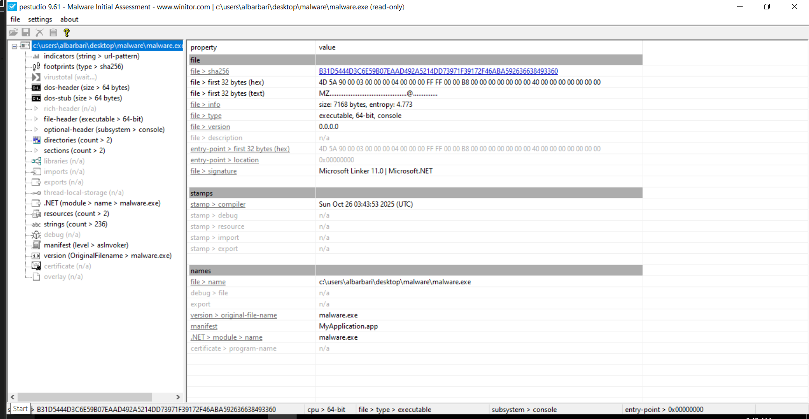

*Figure 4. PEStudio overview showing the basic metadata of malware.exe.*

The executable contains a compiler timestamp of 26 October 2025 at 03:43:53 UTC. However, compile timestamps should not be treated as definitive evidence because they can be altered or generated during the build process. Therefore, the timestamp was considered a weak indicator rather than a reliable IOC.

The executable was also identified as a managed .NET application. This is relevant to the analysis because some functionality may be represented through .NET metadata rather than conventional native PE imports.

## 2.3 PE Section Analysis

PEStudio identified two PE sections, named `.text` and `.rsrc`. Both section names are conventional Windows PE section names, and no custom or suspicious section names were observed. The `.text` section contained executable code and had an entropy value of 5.129, while the `.rsrc` section had an entropy value of 3.705.

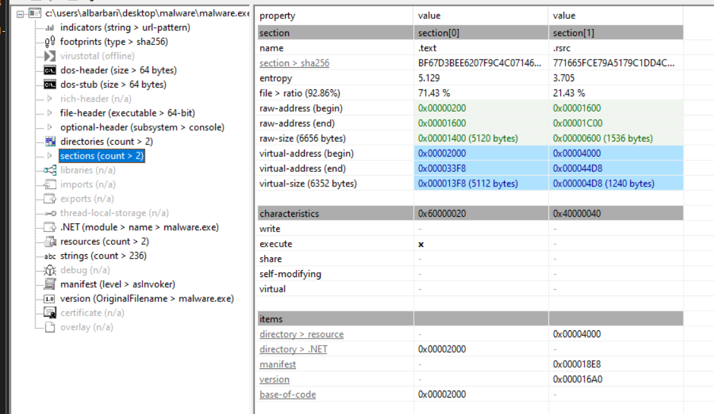

*Figure 5. PEStudio section analysis showing the .text and .rsrc sections of malware.exe.*

Neither section exhibited unusually high entropy that would independently suggest heavy packing or encryption. The section names themselves were therefore treated as weak/non-suspicious structural signals rather than useful IOCs. The presence of only two sections was noted as a structural characteristic of the sample but was not considered malicious on its own.

## 2.4 .NET Dependency and Code Inspection

Because the sample was identified as a managed .NET executable and did not expose a conventional native import table in PEStudio, dnSpy was used to inspect its managed assembly structure and decompiled code. The executable was successfully decompiled into C#, allowing its classes, referenced assemblies, configuration fields, and API usage to be examined without executing the malware.

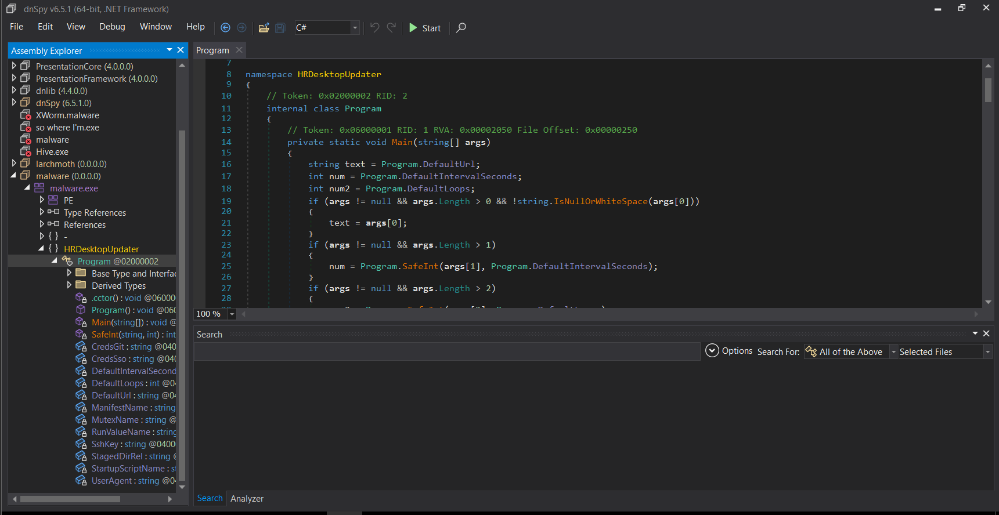

*Figure 6. Static inspection of malware.exe using dnSpy.*

The decompiled assembly contained a namespace named `HRDesktopUpdater` and exposed several configuration-related fields, including references to a URL, execution intervals, loop counts, a mutex, persistence-related values, staging paths, a startup script, and a User-Agent. These field names were treated as leads for further static analysis; their actual values were examined separately before being classified as indicators.

## 2.5 Embedded Configuration and Static IOC Extraction

Further inspection of the decompiled .NET code revealed a static constructor containing several embedded configuration values. These values provided direct leads for network, process, persistence, and file-system indicators without requiring execution of the sample. The configuration included a URI path, mutex name, custom User-Agent string, communication timing values, startup-related filenames, and staging artifacts.

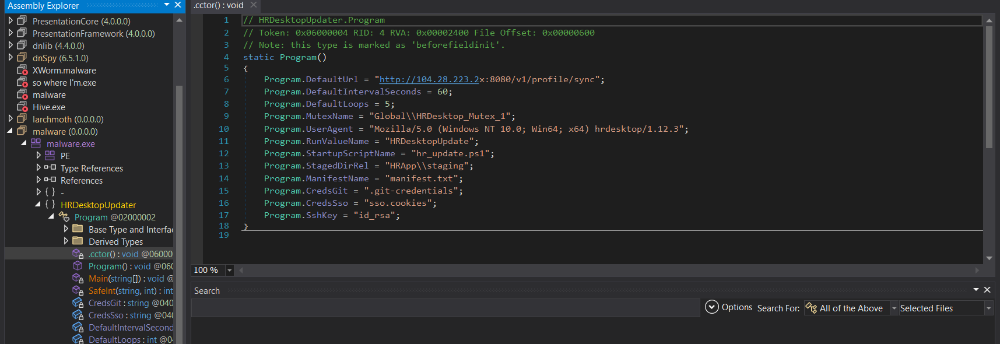

*Figure 7. Embedded configuration values extracted from the static constructor of malware.exe using dnSpy.*

The most distinctive static artifacts were the mutex `Global\HRDesktop_Mutex_1`, the URI path `/v1/profile/sync`, and the custom User-Agent string containing `hrdesktop/1.12.3`. These values are considerably more specific than generic filenames such as `manifest.txt` or `id_rsa` and were therefore treated as stronger detection candidates. The configured interval of 60 seconds and loop count of five were recorded as behavioral hypotheses to be validated during dynamic analysis.

## 2.6 Persistence and Startup Folder Analysis

Inspection of the decompiled `Main()` method revealed direct persistence-related behavior. The program creates a named mutex using the previously identified `Global\HRDesktop_Mutex_1` value and then resolves the current user's Windows Startup directory. It combines this path with the embedded filename `hr_update.ps1` and writes a PowerShell script to the resulting location.

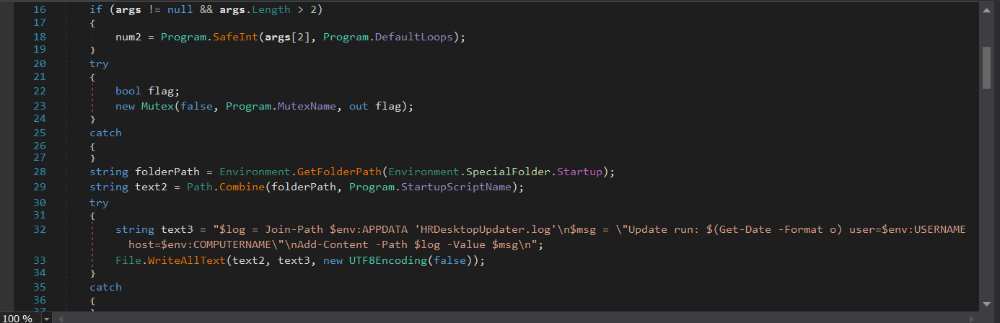

*Figure 8. Decompiled code showing mutex creation and a PowerShell script being written to the Windows Startup folder.*

The startup script writes execution information to `HRDesktopUpdater.log` under the user's AppData directory, including the current timestamp, username, and computer name. The Startup-folder write represents a strong persistence-related behavioral indicator, while the mutex provides a distinctive process-level IOC. These findings were identified statically and were later selected for validation during dynamic analysis.

## 2.7 Registry Persistence Analysis

Static analysis also revealed an additional persistence mechanism through the Windows Registry. The sample accesses the current user's Run key at:

`HKCU\Software\Microsoft\Windows\CurrentVersion\Run`

and creates a value named `HRDesktopUpdate`. The associated command launches PowerShell with execution-policy bypass and a hidden window to execute the previously identified `hr_update.ps1` script.

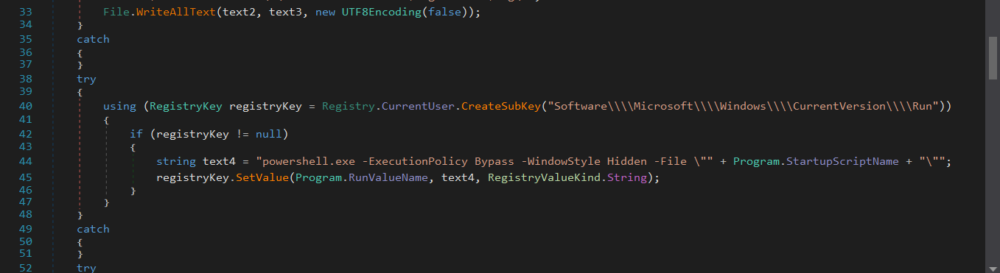

*Figure 9. Decompiled code showing HKCU Run-key persistence through the HRDesktopUpdate registry value.*

The registry value data is constructed as:

```powershell
powershell.exe -ExecutionPolicy Bypass -WindowStyle Hidden -File "hr_update.ps1"
```

This represents a strong persistence-related IOC because both the registry value name and execution command are specific to the sample. The effectiveness of this persistence mechanism was reserved for validation during dynamic analysis.

## 2.8 File System Staging Behavior

Static analysis revealed that the sample creates a staging directory under the current user's Application Data directory. The path is constructed from `%APPDATA%` and the embedded relative path `HRApp\staging`. The malware then creates several files within this directory, including a manifest and credential-like artifacts.

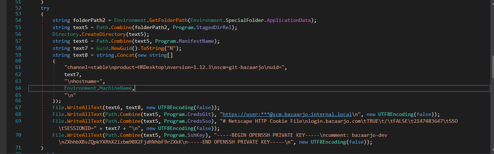

*Figure 10. Decompiled code showing creation of the staging directory and credential-like files under AppData.*

The staging directory is expected to resolve to:

```text
%APPDATA%\HRApp\staging
```

The sample writes:

- `manifest.txt`
- `.git-credentials`
- `sso.cookies`
- `id_rsa`

The generated manifest contains information such as the product name, version, a unique GUID, and the host name. Embedded strings also reference `scm.bazaarjo-internal.local` and `login.bazaarjo.com`.

At this stage, these artifacts were interpreted as staged file-system indicators rather than evidence of actual credential theft, because the decompiled code shown here creates the files directly. Their presence and exact paths were therefore reserved for confirmation during dynamic analysis.

## 2.9 Network Communication and Beaconing Logic

Static analysis of the decompiled networking logic revealed that the sample constructs HTTP GET requests using the embedded endpoint. Each request appends URL-encoded parameters containing the current username (`u`), computer name (`h`), application version (`ver`), release channel (`chan`), and loop index (`i`). The request also uses the embedded custom User-Agent and a five-second network timeout.

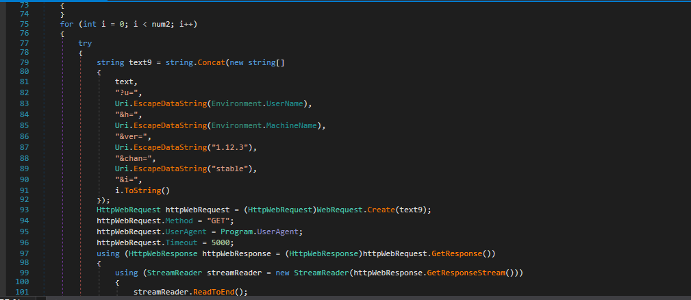

*Figure 11. Decompiled code showing HTTP GET request construction and use of the custom User-Agent.*

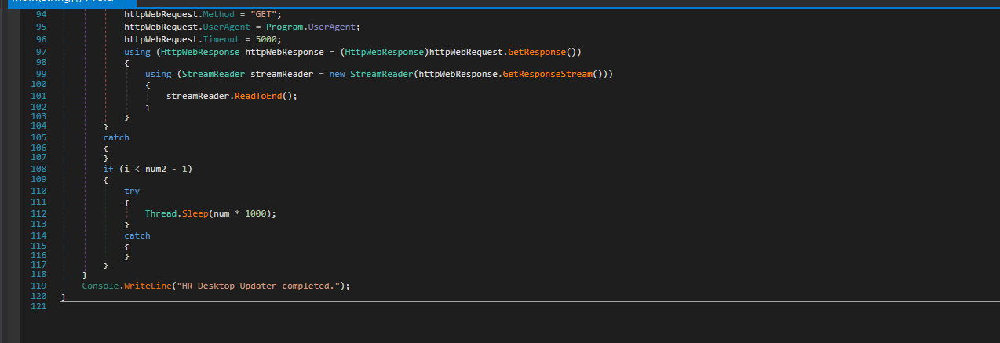

*Figure 12. Decompiled loop and sleep logic controlling the interval between network requests.*

The networking routine is executed inside a loop. By default, the sample is configured for five iterations, and the code calls `Thread.Sleep(num * 1000)` between requests. Because the default interval is 60 seconds, the static configuration indicates a default communication cadence of approximately one request every 60 seconds, with four sleep periods occurring between the five requests. Both the interval and loop count can be overridden through command-line arguments, so these values represent the sample's default behavior rather than fixed constants.

The URI path `/v1/profile/sync` and the custom User-Agent `Mozilla/5.0 (Windows NT 10.0; Win64; x64) hrdesktop/1.12.3` were considered strong static network indicators because of their specificity. In contrast, the use of the HTTP GET method and a five-second timeout were considered weak signals because they are common in legitimate software. The 60-second cadence was recorded as a behavioral indicator to be verified during dynamic network analysis.

## 2.10 String Extraction

String extraction was performed against `malware.exe` without executing the sample. The extracted ASCII strings exposed several meaningful configuration-related identifiers, including references to the default URL, mutex name, User-Agent, registry persistence value, startup script, staging directory, and credential-related filenames. Generic PE and .NET strings were also present and were treated as low-value findings.

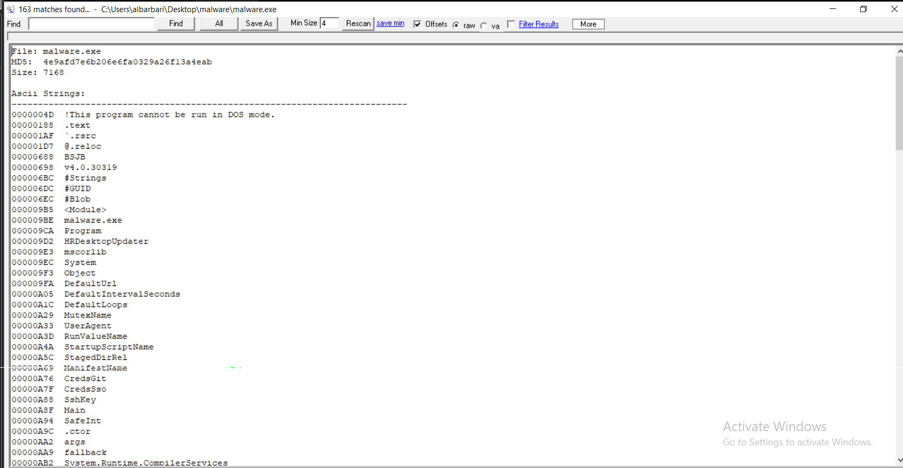

*Figure 13. Static string extraction from malware.exe showing configuration-related identifiers.*

The initial string set contained both generic .NET/PE metadata and more relevant malware-specific identifiers. Generic values such as `System`, `Object`, and standard section names were considered weak signals, while configuration identifiers associated with networking, persistence, and process behavior were prioritized for further inspection.

Further review of the extracted strings exposed the actual embedded values associated with the sample's network communication, persistence, process control, and staging behavior. These values were correlated with the decompiled code to distinguish simple embedded text from indicators that are actively used by the program.

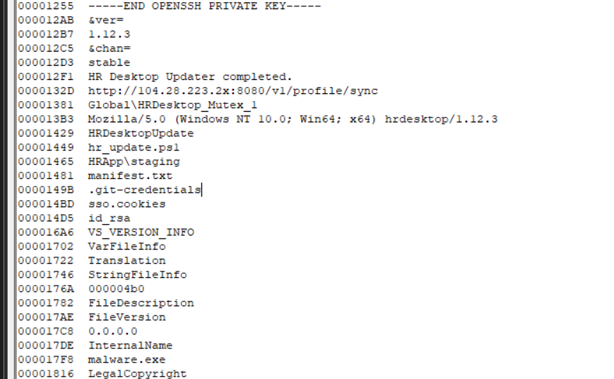

*Figure 14. Extracted strings showing embedded network, mutex, persistence, and staging indicators.*

The strongest extracted strings were `Global\HRDesktop_Mutex_1`, the URI path `/v1/profile/sync`, and the custom User-Agent containing `hrdesktop/1.12.3`. These values were also confirmed in the decompiled code as being actively used for mutex creation and HTTP communication. The strings `HRDesktopUpdate`, `hr_update.ps1`, and `HRApp\staging` were correlated with the registry and file-system persistence behavior identified previously.

The embedded endpoint string contained `104.28.223.2x`, which is not a syntactically valid IPv4 address because of the non-numeric character. Therefore, the host portion was recorded as an embedded endpoint string rather than a validated IP IOC, while `/v1/profile/sync` was retained as a reliable URI indicator.

## 2.11 Managed Dependencies

Because the executable is a managed .NET application, its dependencies were inspected through dnSpy rather than relying solely on a conventional native PE import table. The assembly referenced the standard .NET libraries `mscorlib` and `System`.


*Figure 15. Managed assembly references identified in dnSpy.*

Although the dependency list itself is generic and provides little detection value, decompilation revealed the specific .NET APIs used by the sample, including registry access, file creation, HTTP requests, mutex creation, and thread sleeping. These API usages were considered more useful for understanding the sample's behavior than the generic assembly references themselves.

---

# 3. Dynamic Analysis

## 3.1 Dynamic Analysis Preparation

Process Monitor was configured before execution to capture activity generated specifically by `malware.exe`. The monitoring scope included file-system operations, registry activity, and network-related events. Filtering by process name reduced unrelated operating-system noise while preserving the malware's runtime activity.

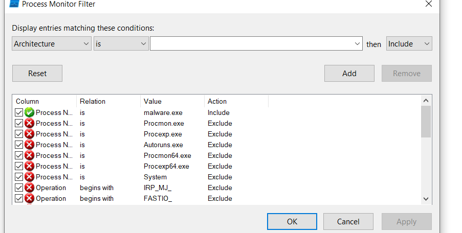

*Figure 16. Process Monitor configured to capture activity generated by malware.exe.*

The event log was cleared before execution so that subsequent observations could be directly correlated with the malware sample.

## 3.2 Registry Persistence

Dynamic analysis confirmed the registry persistence behavior identified during static analysis. Process Monitor recorded a successful `RegSetValue` operation generated by `malware.exe` under the current user's Windows Run key.


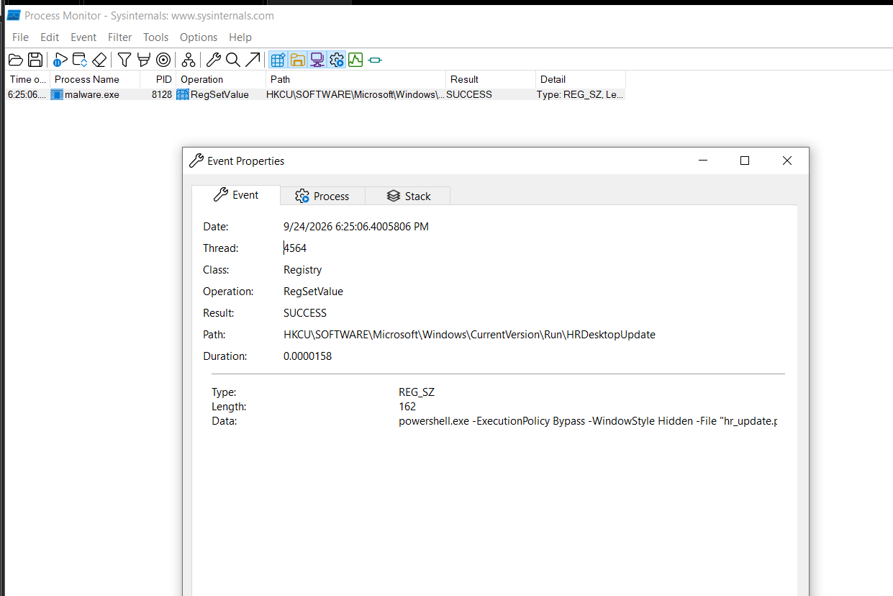

*Figure 16. Process Monitor evidence of successful Run-key persistence created by malware.exe.*

The sample created the registry value `HRDesktopUpdate` under:

```text
HKCU\SOFTWARE\Microsoft\Windows\CurrentVersion\Run
```

The value launches PowerShell with `-ExecutionPolicy Bypass` and `-WindowStyle Hidden` to execute `hr_update.ps1`. The operation returned `SUCCESS`, confirming that the persistence mechanism observed during static analysis was successfully written to the registry at runtime.

## 3.3 Startup Folder Persistence

Dynamic file-system monitoring confirmed the Startup-folder persistence behavior identified during static analysis. Process Monitor recorded `malware.exe` successfully writing the PowerShell script `hr_update.ps1` into the current user's Windows Startup directory.

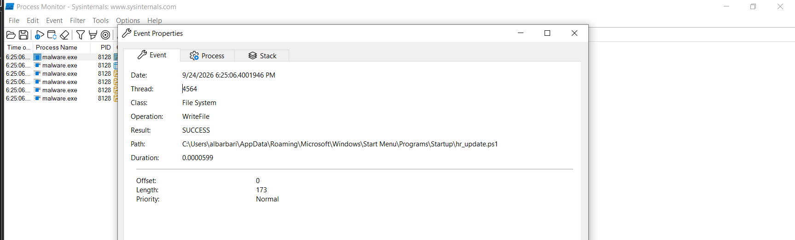

*Figure 17. Process Monitor evidence of hr_update.ps1 being written to the Windows Startup folder.*

The successful `WriteFile` operation confirmed that the sample created:

```text
C:\Users\albarbari\AppData\Roaming\Microsoft\Windows\Start Menu\Programs\Startup\hr_update.ps1
```

This represents a high-confidence persistence indicator and directly validates the behavior observed during static analysis.

## 3.4 Staging Directory and Dropped Files

Dynamic file-system monitoring confirmed the staging behavior identified during static analysis. Process Monitor recorded multiple successful `WriteFile` operations performed by `malware.exe` under:

```text
C:\Users\albarbari\AppData\Roaming\HRApp\staging
```

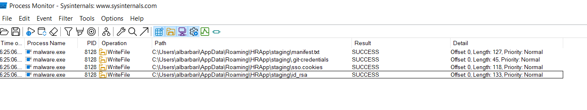

*Figure 18. Process Monitor evidence of files written by malware.exe to the HRApp staging directory.*

The sample successfully created `manifest.txt`, `.git-credentials`, `sso.cookies`, and `id_rsa` inside the staging directory. These runtime observations directly confirmed the file-system artifacts previously identified during static analysis.

Although several filenames resemble credential-related files, the observed evidence only confirms that the sample created these files and does not independently demonstrate theft of real credentials from the host.

## 3.5 Network Traffic Analysis

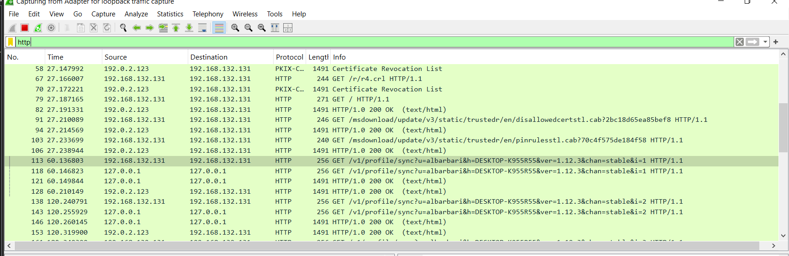

Wireshark was opened and the display filter `http` was used to review the requests generated during execution.

Wireshark was used to capture network traffic generated during execution of `malware.exe` inside the isolated FLARE VM environment. After the sample generated HTTP traffic, the capture was filtered to identify requests associated with the `/v1/profile/sync` URI. One of the HTTP connections was then inspected using **Follow TCP Stream** to view the complete request headers and parameters in a readable format.

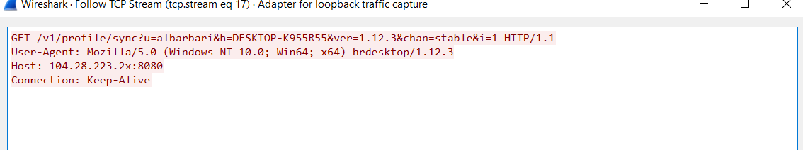

*Figure 19. Follow TCP Stream view showing the complete HTTP GET request generated by malware.exe.*

The sample generated an HTTP GET request to the URI `/v1/profile/sync` and appended the parameters `u`, `h`, `ver`, `chan`, and `i`. The custom User-Agent was:

```text
Mozilla/5.0 (Windows NT 10.0; Win64; x64) hrdesktop/1.12.3
```

The Host header contained the embedded endpoint:

```text
104.28.223.2x:8080
```

The username and hostname values were generated from the analysis system and were therefore treated as runtime parameters rather than reusable IOCs.

## 3.6 Network Communication and Beaconing Behavior

To validate the timing behavior observed during static analysis, the HTTP traffic was filtered specifically for requests containing `/v1/profile/sync`. Five sequential requests were captured with loop indexes from `i=0` through `i=4`.

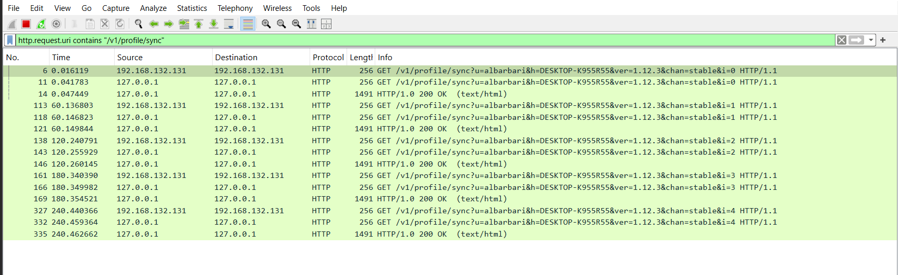

*Figure 20. Wireshark evidence of five HTTP requests generated at approximately 60-second intervals.*

The first request was observed at approximately 0 seconds, followed by additional requests at approximately 60, 120, 180, and 240 seconds. This confirms a default beaconing cadence of approximately 60 seconds and a total of five communication attempts, matching the values previously identified in the decompiled code.

Each request used the same `/v1/profile/sync` URI pattern while incrementing the `i` parameter from 0 to 4. This regular timing pattern represents a high-confidence behavioral IOC because it was identified statically and independently confirmed during controlled execution.

## 3.7 Execution Timeline

The following timeline summarizes the main behaviors observed after execution of `malware.exe`. Times are presented relative to the start of execution and are based on Process Monitor and Wireshark observations.

| Relative Time | Observed Activity |
|---|---|
| ~0 s | `malware.exe` starts and creates the mutex `Global\HRDesktop_Mutex_1`. |
| ~0 s | The sample writes `hr_update.ps1` to the current user's Windows Startup folder. |
| ~0 s | The registry value `HKCU\SOFTWARE\Microsoft\Windows\CurrentVersion\Run\HRDesktopUpdate` is successfully created for persistence. |
| ~0 s | The staging directory `%APPDATA%\HRApp\staging` is used to create `manifest.txt`, `.git-credentials`, `sso.cookies`, and `id_rsa`. |
| ~0 s | First HTTP GET request is generated to `/v1/profile/sync` with loop index `i=0`. |
| ~60 s | Second HTTP request is generated with `i=1`. |
| ~120 s | Third HTTP request is generated with `i=2`. |
| ~180 s | Fourth HTTP request is generated with `i=3`. |
| ~240 s | Fifth and final default HTTP request is generated with `i=4`. |

The execution sequence closely matched the behavior identified during static analysis. Persistence and staging operations occurred immediately after execution, followed by five HTTP communication attempts separated by approximately 60 seconds. This correlation between static and dynamic findings increased confidence in the identified behavioral and host-based indicators.

---

# 4. IOC Analysis

| Category | IOC / Pattern | Evidence | Confidence | Rationale |
|---|---|---|---|---|
| Network | `/v1/profile/sync` | Static + Dynamic | High | Specific URI embedded in the sample and confirmed in repeated HTTP GET requests. |
| Network | `Mozilla/5.0 (Windows NT 10.0; Win64; x64) hrdesktop/1.12.3` | Static + Dynamic | High | Custom User-Agent identified in code and confirmed in the captured TCP stream. |
| Network | `104.28.223.2x:8080` | Static + Dynamic | Medium | Specific Host value observed in both code and runtime traffic, but the host is not a syntactically valid IPv4 address. |
| Network | `?u=<username>&h=<hostname>&ver=1.12.3&chan=stable&i=<n>` | Static + Dynamic | High | Consistent request structure confirmed in decompiled code and Wireshark. |
| File System | `%APPDATA%\Microsoft\Windows\Start Menu\Programs\Startup\hr_update.ps1` | Static + Dynamic | High | Startup persistence path identified in code and successfully written at runtime. |
| File System | `%APPDATA%\HRApp\staging` | Static + Dynamic | High | Specific staging directory used by the sample and confirmed through runtime file writes. |
| File System | `manifest.txt` | Static + Dynamic | Medium | Confirmed dropped file, but the filename alone is generic. |
| File System | `.git-credentials` | Static + Dynamic | Medium | Confirmed staging artifact, although the filename may occur legitimately. |
| File System | `sso.cookies` | Static + Dynamic | Medium | Confirmed runtime artifact with credential-related naming. |
| File System | `id_rsa` | Static + Dynamic | Medium | Confirmed dropped file, but `id_rsa` is a common SSH-key filename and is weak when considered alone. |
| Registry | `HKCU\SOFTWARE\Microsoft\Windows\CurrentVersion\Run\HRDesktopUpdate` | Static + Dynamic | High | Specific persistence value identified in code and confirmed by a successful Procmon RegSetValue event. |
| Registry | `powershell.exe -ExecutionPolicy Bypass -WindowStyle Hidden -File "hr_update.ps1"` | Static + Dynamic | High | Persistence command confirmed as the data associated with the Run-key value. |
| Process | `Global\HRDesktop_Mutex_1` | Static | High | Distinctive mutex directly used by the program for process control; not independently verified at runtime. |
| Behavioral | Approximately 60-second request interval | Static + Dynamic | High | Decompiled `Thread.Sleep()` logic matched Wireshark timestamps. |
| Behavioral | 5 HTTP communication attempts (`i=0` through `i=4`) | Static + Dynamic | High | Default loop count matched five sequential requests observed dynamically. |

## 4.1 Top 3 Most Reliable IOCs

Three indicators were considered the most reliable because they were highly specific and supported by both static and dynamic evidence:

### 1. URI Path — `/v1/profile/sync`

This path was embedded directly in the malware configuration and repeatedly observed in Wireshark during execution.

### 2. Custom User-Agent

```text
Mozilla/5.0 (Windows NT 10.0; Win64; x64) hrdesktop/1.12.3
```

The User-Agent contains a distinctive application identifier and version and was confirmed in both the decompiled code and runtime HTTP traffic.

### 3. Registry Persistence

```text
HKCU\SOFTWARE\Microsoft\Windows\CurrentVersion\Run\HRDesktopUpdate
```

This persistence indicator was identified statically and independently confirmed through a successful `RegSetValue` operation in Process Monitor.

## 4.2 Behavioral Patterns

The sample demonstrated a consistent execution pattern. Immediately after execution, it established persistence through both a Startup-folder script and an HKCU Run-key value and created a staging directory containing several credential-like files.

It then initiated a sequence of five HTTP GET requests using the `/v1/profile/sync` URI. The requests occurred at approximately 60-second intervals and incremented the `i` parameter from 0 to 4. This timing behavior matched the loop and sleep logic recovered during static analysis.

Generic artifacts such as the `.text` and `.rsrc` PE sections, standard .NET references such as `System` and `mscorlib`, the use of HTTP GET, and filenames such as `manifest.txt` or `id_rsa` were considered weak signals when evaluated in isolation. Their value increased only when correlated with the more specific persistence, staging, and network behavior of the sample.

---

# 5. Detection Rules

## 5.1 YARA Rule Development

A YARA rule was developed to detect the analyzed malware using family-oriented characteristics rather than relying solely on the exact file hash. The rule combines distinctive embedded indicators with structural PE checks to reduce false positives and provide better resilience against modified variants of the sample.

```yara
import "pe"

rule HRDesktop_LummaLike_Dropper
{
    meta:
        description = "Detects HRDesktop/Lumma-like training dropper using family-oriented indicators"
        author = "Session 21 Malware Analysis"
        sample_sha256 = "b31d5444d3c6e59b07eaad492a5214dd73971f39172f46aba592636638493360"

    strings:
        $mutex   = "Global\\HRDesktop_Mutex_1" ascii wide
        $uri     = "/v1/profile/sync" ascii wide
        $ua      = "hrdesktop/1.12.3" ascii wide nocase
        $run     = "HRDesktopUpdate" ascii wide
        $startup = "hr_update.ps1" ascii wide
        $stage   = "HRApp\\staging" ascii wide

    condition:
        uint16(0) == 0x5A4D and
        filesize < 2MB and
        pe.number_of_sections >= 1 and
        pe.number_of_sections <= 6 and
        $mutex and
        $uri and
        1 of ($ua, $run, $startup, $stage)
}
```

The rule verifies the PE header, restricts the target filesize, and checks that the executable contains a reasonable number of PE sections. The sample SHA-256 is included only as metadata for reference and is not part of the matching condition. This allows the rule to potentially detect related variants whose file hashes differ from the analyzed sample.

---

# 6. Validation Plan

The YARA rule was validated against both a legitimate Windows executable and the analyzed malware sample. The purpose of validation was to confirm that the rule could identify the malicious sample while avoiding an obvious false positive on a clean PE file.

## 6.1 Step 1 — Test Against a Clean File

The rule was first evaluated against the legitimate Windows executable:

```text
C:\Windows\System32\notepad.exe
```

YARA produced no output, indicating that the clean executable did not satisfy the rule conditions. This result demonstrates that the rule did not generate a false positive for this validation sample.

## 6.2 Step 2 — Test Against `malware.exe`

The same YARA rule was tested against `malware.exe`. The rule successfully matched the sample as:

```text
HRDesktop_LummaLike_Dropper
```

Using the `-s` option also displayed the matched strings, including indicators associated with the mutex, URI path, custom User-Agent, persistence value, startup script, and staging directory.

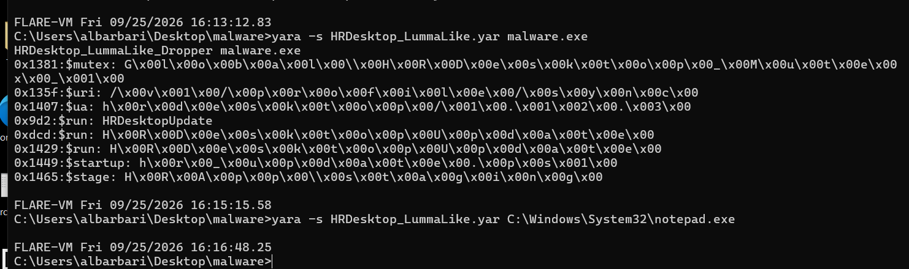

*Figure 21. YARA validation showing successful detection of malware.exe and no match against the legitimate notepad.exe executable.*

The validation results were consistent with the intended detection logic: the analyzed malware satisfied the required structural and string-based conditions, while the clean Windows executable did not match. The rule therefore provides a behavioral and family-oriented alternative to exact SHA-256 matching.
