# Penetration Testing Assessment Report

## 1. Objective

The objective of this assessment was to identify and exploit
vulnerabilities within the provided Virtual Machine environment,
specifically targeting the web service.

## 2. Methodology

### 2.1 Information Gathering & Enumeration

To begin the assessment, a network scan was conducted against the target
IP address `10.10.10.100` to identify active services and open ports.
Nmap was used with version detection and a higher timing template
(`-T4`) to gather this information efficiently.

**Executed command:**

``` bash
nmap -sS -sV -T4 10.10.10.100
```

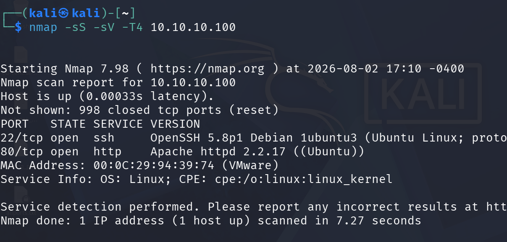

**Findings:**

The initial port scan revealed two open TCP ports on the target system:

-   **Port 22:** Running OpenSSH 5.8p1 (Debian 1ubuntu3).
-   **Port 80:** Running Apache httpd 2.2.17 (Ubuntu).

The operating system was also identified as Linux-based. Based on these
findings, the web service running on port 80 was selected as the primary
vector for further enumeration and potential exploitation.

### 2.2 Web Directory Enumeration

Following the discovery of the web service on port 80, the Metasploit
Framework was used to enumerate web directories and identify the primary
URI paths of the web application. The auxiliary module
`scanner/http/dir_scanner` was used for this purpose.

**Executed commands:**

``` text
use auxiliary/scanner/http/dir_scanner
set RHOSTS 10.10.10.100
run
```

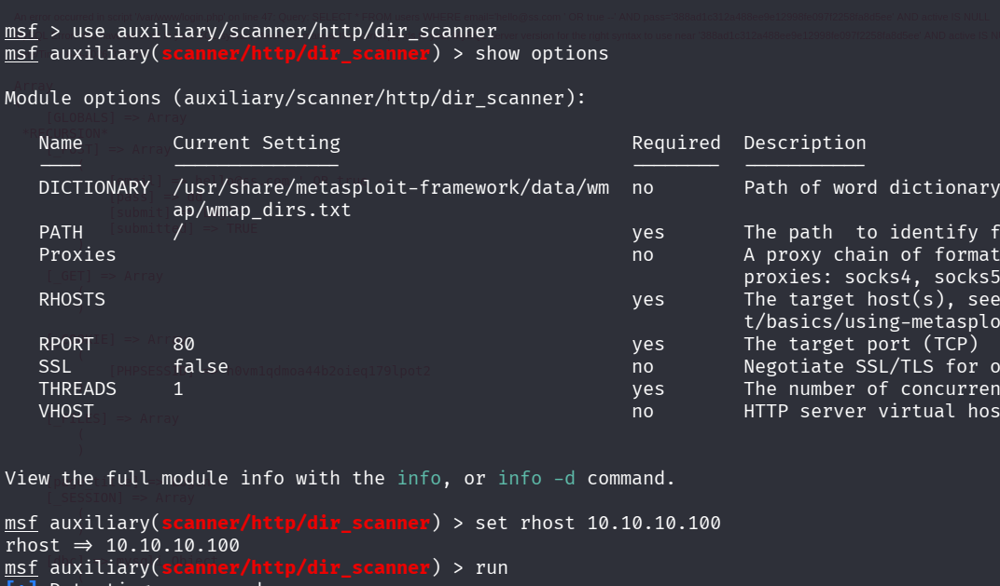

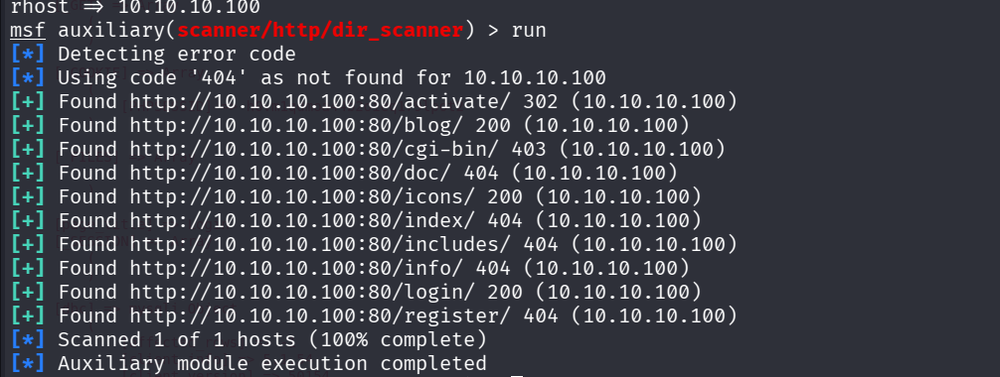

**Findings:**

The directory brute-force scan successfully identified several paths on
the web server. The most notable directories returning a `200 OK` HTTP
status code were:

-   `/blog/`
-   `/login/`

These paths indicated the presence of active web applications and
established the primary targets for the vulnerability analysis phase.

## 3. Web Application Analysis

The `/blog/` page was opened for further inspection.

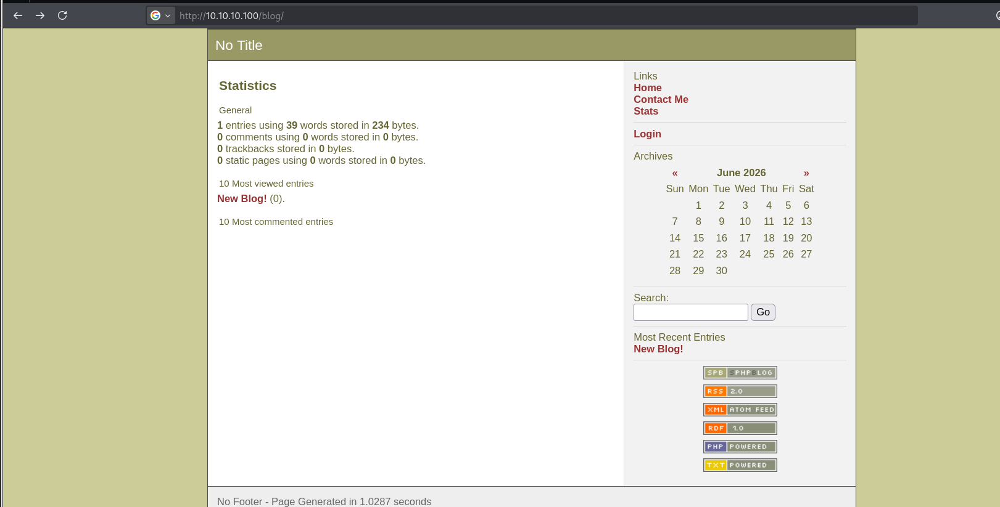

The technologies and programs used to build the blog were then
identified.

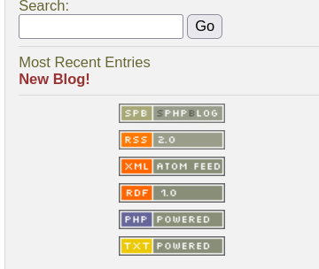

This information was used to identify a potentially applicable
vulnerability and corresponding Metasploit module.

## 4. Vulnerability Identification and Exploitation

The identified technology was searched within the Metasploit Framework
to locate a relevant exploit module.

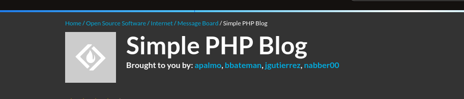

The relevant module was then selected and configured against the target
system.

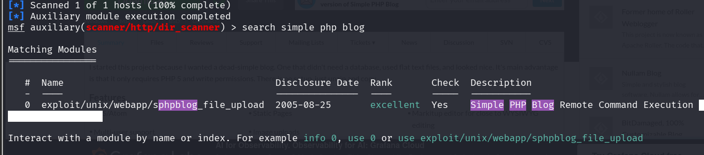

The exploitation steps were followed against the target.

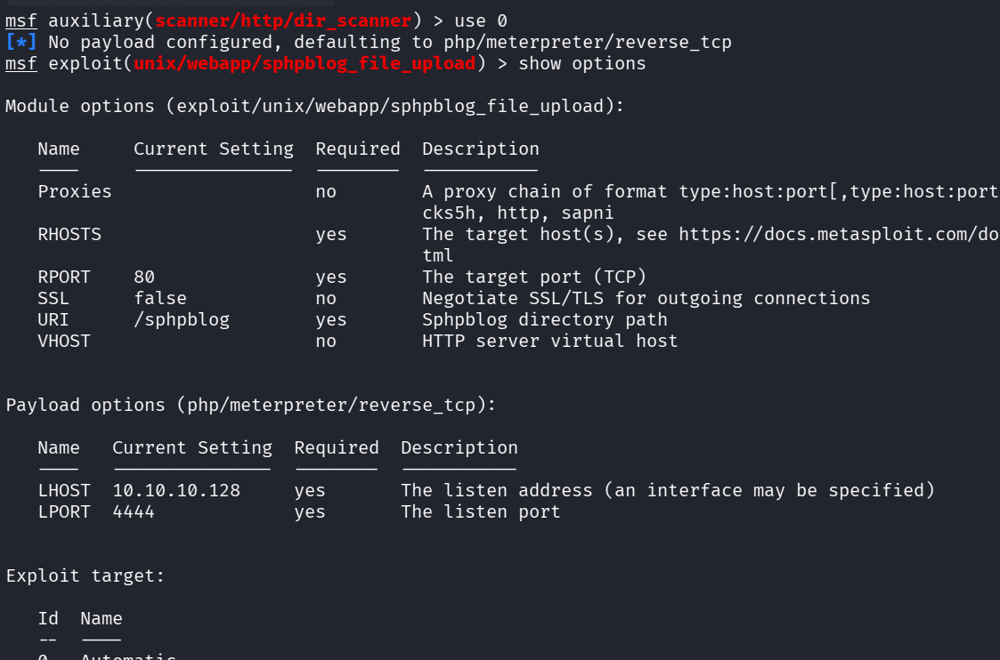

The exploitation resulted in successful Remote Command Execution (RCE).

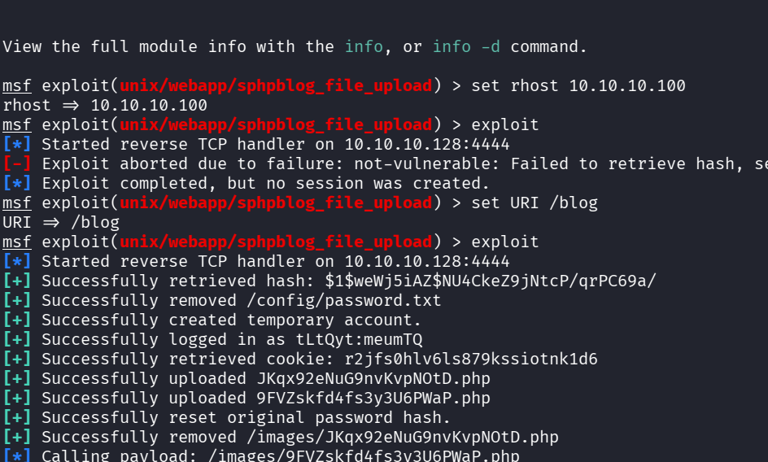

## 5. Proof of Concept (PoC)

To confirm the successful exploitation of the Remote Command Execution
vulnerability, the Meterpreter session was transitioned to an
interactive system shell. A core system command was then executed to
extract kernel and operating-system details.

**Executed command:**

``` bash
uname -a
```

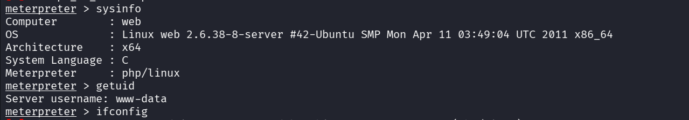

The command output returned the target system's kernel version and OS
architecture.

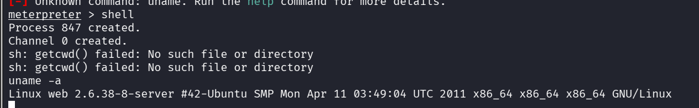

## 6. Findings

The assessment demonstrated that the web application could be exploited
to achieve arbitrary command execution on the target system.

The successful execution of `uname -a` from the compromised host
provides proof that commands could be executed in the context of the
obtained shell. This demonstrates a significant compromise of the web
service and potentially the underlying server.

## 7. Conclusion

The assessment followed a progressive penetration-testing workflow:

1.  Network reconnaissance and service enumeration using Nmap.
2.  Web directory enumeration using Metasploit.
3.  Manual inspection of the discovered web application.
4.  Identification of the underlying technology.
5.  Identification and configuration of a relevant Metasploit exploit.
6.  Successful exploitation leading to Remote Command Execution.
7.  Post-exploitation verification using `uname -a`.

The results demonstrate the importance of keeping web applications and
their underlying components patched and securely configured, while also
minimizing unnecessary exposed services and applying appropriate access
controls.
